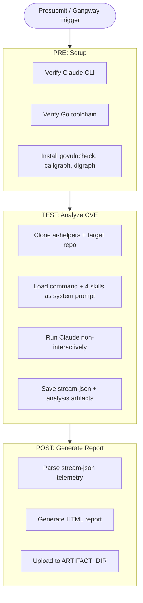

# CVE Analysis Agent Workflow

Automated CVE vulnerability analysis for Go-based OpenShift components using Claude Code and the `compliance:analyze-cve` plugin from [openshift-eng/ai-helpers](https://github.com/openshift-eng/ai-helpers).

## Overview

This workflow runs the full CVE analysis pipeline non-interactively:

1. **Setup**: Verifies Claude CLI, Go toolchain, and installs analysis tools (govulncheck, callgraph, digraph)
2. **Process**: Clones the target repository, loads all compliance skills, runs Claude with the analyze-cve pipeline
3. **Report**: Generates an HTML report with token usage, cost, and analysis output

## Data Flow



## Environment Variables

| Variable | Required | Default | Description |
|----------|----------|---------|-------------|
| `CVE_AGENT_CVE_ID` | Yes | - | CVE identifier (e.g., `CVE-2024-45338`) |
| `CVE_AGENT_TARGET_REPO` | Yes | - | GitHub repo (e.g., `openshift/secrets-store-csi-driver-operator`) |
| `CVE_AGENT_TARGET_BRANCH` | No | `main` | Branch to analyze |
| `CVE_AGENT_ALGO` | No | `vta` | Call graph algorithm (`vta`, `rta`, `cha`, `static`) |
| `CLAUDE_MODEL` | No | `claude-opus-4-6` | Claude model |

## Secrets

All steps mount `test-credentials/hypershift-team-claude-prow` at `/var/run/claude-code-service-account/`.

Required keys:
- `claude-prow` -- GCP service account JSON for Vertex AI authentication

## Usage

### As an optional presubmit (triggered via `/test cve-analysis`)

```yaml
- always_run: false
  as: cve-analysis
  optional: true
  skip_if_only_changed: .*
  steps:
    env:
      CVE_AGENT_CVE_ID: "CVE-2024-45338"
      CVE_AGENT_TARGET_REPO: "openshift/secrets-store-csi-driver-operator"
    workflow: compliance-cve-agent
```

## Report

The HTML report is saved as `cve-agent-report.html` in the CI artifacts directory and includes:
- Analysis status and metadata (CVE, repo, algorithm, model)
- Token usage and cost breakdown
- Full analysis output text
- Tool call and error summaries
- Generated analysis report (if produced)
