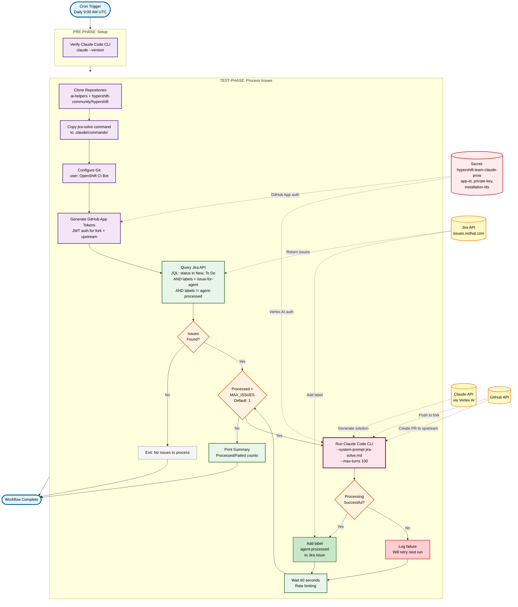

# HyperShift Jira Agent Workflow

Automated periodic job that processes Jira issues labeled with `issue-for-agent` and creates pull requests using Claude Code.

## Overview

This workflow implements a fully automated system for processing HyperShift Jira issues:

1. **Query**: Searches Jira for unresolved issues in OCPBUGS and CNTRLPLANE projects with label `issue-for-agent` (excluding those with `agent-processed`)
2. **Process**: For each issue, runs the `/jira-solve` command from the HyperShift repository non-interactively
3. **Track**: Adds `agent-processed` label to successfully processed issues to prevent reprocessing

## Data Flow Diagram



## Components

### Workflow
- **File**: `hypershift-jira-agent-workflow.yaml`
- **Description**: Defines the two-phase workflow (pre/test)

### Steps

#### 1. Setup (`hypershift-jira-agent-setup`)
- Verifies Claude Code CLI is available

#### 2. Process (`hypershift-jira-agent-process`)
- Clones ai-helpers and hypershift-community/hypershift repositories
- Copies jira-solve command to `.claude/commands/`
- Configures git and generates GitHub App tokens (JWT auth)
- Queries Jira API for labeled issues (excluding those with `agent-processed`)
- Runs jira-solve for each issue using Claude Code CLI with `--system-prompt`
- Pushes branches to fork, creates PRs to upstream openshift/hypershift
- Implements rate limiting (60s between issues)
- Adds `agent-processed` label to successfully processed issues

## Configuration

### Secrets Required

The workflow requires a single secret in the `test-credentials` namespace:

**`hypershift-team-claude-prow`**
- Mount path: `/var/run/claude-code-service-account`
- Required keys:
  - `claude-prow`: GCP service account JSON key for Vertex AI authentication
  - `app-id`: GitHub App ID
  - `private-key`: GitHub App private key for JWT signing
  - `installation-id`: GitHub App installation ID for hypershift-community fork
  - `o-h-installation-id`: GitHub App installation ID for openshift/hypershift upstream

The workflow uses GitHub App authentication (JWT-based) rather than personal access tokens. This provides better security and allows fine-grained permissions.

**Optional** (currently disabled for testing):
- `hypershift-jira-token`: Jira API token for adding `agent-processed` labels

These should be configured in Vault with secretsync metadata and synced automatically.

### Periodic Job

Configured in `ci-operator/config/openshift/hypershift/openshift-hypershift-main.yaml`:

```yaml
- as: periodic-jira-agent
  cron: 0 9 * * *  # Daily at 9:00 AM UTC
  steps:
    env:
      JIRA_AGENT_MAX_ISSUES: "1"  # Start with 1 for testing, increase later
    workflow: hypershift-jira-agent
```

### Environment Variables

- **`JIRA_AGENT_MAX_ISSUES`** (default: `1`)
  - Maximum number of issues to process per run
  - Set to `1` initially for safe testing
  - Can be increased to `5`, `10`, or higher once validated
  - Counts both successful and failed processing attempts

### State Management

State is tracked using Jira labels:
- **Label**: `agent-processed`
- When an issue is successfully processed, the `agent-processed` label is added
- The JQL query excludes issues with this label, preventing reprocessing
- Failed issues are NOT labeled, allowing automatic retry on subsequent runs

To reprocess an issue:
1. Remove the `agent-processed` label from the Jira issue
2. The issue will be picked up on the next run

## How It Works

### Non-Interactive Execution

The workflow uses Claude Code CLI's non-interactive mode with a system prompt:

```bash
claude -p "$ISSUE_KEY origin --ci" \
  --system-prompt "$SKILL_CONTENT" \
  --allowedTools "Bash Read Write Edit Grep Glob WebFetch" \
  --max-turns 100 \
  --verbose \
  --output-format stream-json
```

The jira-solve command is loaded from `ai-helpers/plugins/jira/commands/solve.md` and passed as a system prompt. This allows Claude to analyze the Jira issue and create a PR automatically.

### Jira Query

Issues are queried using JQL:
```
project in (OCPBUGS, CNTRLPLANE) AND resolution = Unresolved AND status in (New, "To Do") AND labels = issue-for-agent AND labels != agent-processed
```

Maximum issues queried and processed is controlled by `JIRA_AGENT_MAX_ISSUES` (default: 1).

### Rate Limiting

- 60 seconds between processing each issue
- Maximum 100 agentic turns per issue
- Maximum issues per run: configurable via `JIRA_AGENT_MAX_ISSUES`
- Runs once daily at 9:00 AM UTC

## Container Image

Uses the `claude-ai-helpers` image from OpenShift CI containing:
- Claude Code CLI
- GitHub CLI (gh)
- jq, git, curl
- Required dependencies

## Local Testing

Use the test script:

```bash
export ANTHROPIC_API_KEY=your-key
export GITHUB_TOKEN=your-token
./tools/hypershift-jira-agent/test-locally.sh
```

## Monitoring

### Success Indicators
- Issues processed successfully with PRs created
- `agent-processed` label added to processed issues
- No authentication errors

### Failure Indicators
- Failed to authenticate with Claude API
- Failed to create PRs (GitHub auth issues)
- Individual issue processing failures

### Logs
Check Prow job logs for:
- Jira query results
- Processing output for each issue
- PR URLs created
- Error messages

## Maintenance

### Adding/Removing Issues
Add or remove the `issue-for-agent` label in Jira to control which issues are processed.

### Reprocessing an Issue
To reprocess an issue, remove the `agent-processed` label from the Jira issue:
1. Open the issue in Jira
2. Remove the `agent-processed` label
3. The issue will be picked up on the next scheduled run

### Adjusting Frequency
Modify the `cron` schedule in the CI config file. Currently runs daily at 9:00 AM UTC.

### Adjusting Issue Limit
Modify the `JIRA_AGENT_MAX_ISSUES` environment variable in the CI config file:
```yaml
env:
  JIRA_AGENT_MAX_ISSUES: "5"  # Increase from 1 to 5
```
Then run `make update` to regenerate job configs.

## Troubleshooting

### Issue: No issues being processed
- Check Jira query returns results
- Verify `issue-for-agent` label exists on issues
- Verify `agent-processed` label is NOT on issues (or remove it to reprocess)

### Issue: Authentication failures
- Verify secrets are mounted correctly
- Check API keys are valid and not expired
- Ensure GitHub token has required permissions

### Issue: PR creation fails
- Check GitHub token permissions
- Verify HyperShift repository access
- Review `/jira-solve` command output in logs

## Future Enhancements

- Slack notifications for processed issues
- Metrics push to Prometheus
- Automatic retries for transient failures
- Priority-based processing
- Issue assignment tracking
