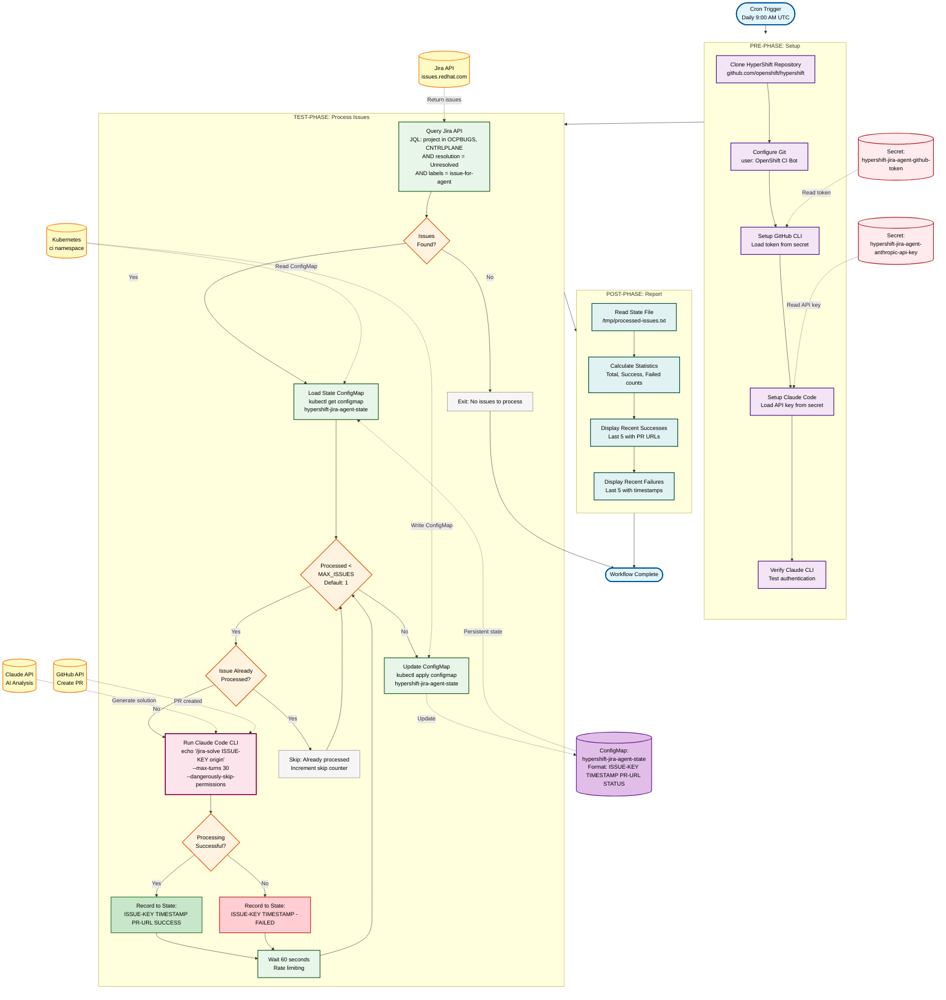

# HyperShift Jira Agent Workflow

Automated periodic job that processes Jira issues labeled with `issue-for-agent` and creates pull requests using Claude Code.

## Overview

This workflow implements a fully automated system for processing HyperShift Jira issues:

1. **Query**: Searches Jira for unresolved issues in OCPBUGS and CNTRLPLANE projects with label `issue-for-agent`
2. **Process**: For each issue, runs the `/jira-solve` command from the HyperShift repository non-interactively
3. **Track**: Maintains state in a ConfigMap to avoid reprocessing issues
4. **Report**: Generates summary of processed issues and results

## Data Flow Diagram


```mermaid
flowchart TD
    %% Trigger
    Start([Cron Trigger<br/>Daily 9:00 AM UTC]):::trigger --> PrePhase

    %% PRE-PHASE: Setup
    subgraph PrePhase[PRE-PHASE: Setup]
        direction TB
        Clone[Clone HyperShift Repository<br/>github.com/openshift/hypershift]:::setup
        GitConfig[Configure Git<br/>user: OpenShift CI Bot]:::setup
        GitHubAuth[Setup GitHub CLI<br/>Load token from secret]:::setup
        ClaudeAuth[Setup Claude Code<br/>Load API key from secret]:::setup
        Verify[Verify Claude CLI<br/>Test authentication]:::setup

        Clone --> GitConfig --> GitHubAuth --> ClaudeAuth --> Verify
    end

    %% Secrets for Setup
    Secret1[(Secret:<br/>hypershift-jira-agent-github-token)]:::secret -.->|Read token| GitHubAuth
    Secret2[(Secret:<br/>hypershift-jira-agent-anthropic-api-key)]:::secret -.->|Read API key| ClaudeAuth

    %% TEST-PHASE: Process
    PrePhase --> TestPhase

    subgraph TestPhase[TEST-PHASE: Process Issues]
        direction TB

        QueryJira[Query Jira API<br/>JQL: project in OCPBUGS, CNTRLPLANE<br/>AND resolution = Unresolved<br/>AND labels = issue-for-agent]:::process
        LoadState[Load State ConfigMap<br/>kubectl get configmap<br/>hypershift-jira-agent-state]:::process

        CheckIssues{Issues<br/>Found?}:::decision
        CheckMax{Processed <<br/>MAX_ISSUES<br/>Default: 1}:::decision
        CheckProcessed{Issue Already<br/>Processed?}:::decision
        CheckSuccess{Processing<br/>Successful?}:::decision

        ProcessIssue[Run Claude Code CLI<br/>echo '/jira-solve ISSUE-KEY origin'<br/>--max-turns 30<br/>--dangerously-skip-permissions]:::ai

        RecordSuccess[Record to State:<br/>ISSUE-KEY TIMESTAMP PR-URL SUCCESS]:::success
        RecordFailure[Record to State:<br/>ISSUE-KEY TIMESTAMP - FAILED]:::failure
        Skip[Skip: Already processed<br/>Increment skip counter]:::skip
        NoIssues[Exit: No issues to process]:::skip

        RateLimit[Wait 60 seconds<br/>Rate limiting]:::process
        UpdateState[Update ConfigMap<br/>kubectl apply configmap<br/>hypershift-jira-agent-state]:::process

        QueryJira --> CheckIssues
        CheckIssues -->|No| NoIssues
        CheckIssues -->|Yes| LoadState
        LoadState --> CheckMax
        CheckMax -->|No| UpdateState
        CheckMax -->|Yes| CheckProcessed
        CheckProcessed -->|Yes| Skip
        CheckProcessed -->|No| ProcessIssue
        Skip --> CheckMax
        ProcessIssue --> CheckSuccess
        CheckSuccess -->|Yes| RecordSuccess
        CheckSuccess -->|No| RecordFailure
        RecordSuccess --> RateLimit
        RecordFailure --> RateLimit
        RateLimit --> CheckMax
    end

    %% External Systems
    JiraAPI[(Jira API<br/>issues.redhat.com)]:::external -.->|Return issues| QueryJira
    K8sCluster[(Kubernetes<br/>ci namespace)]:::external -.->|Read ConfigMap| LoadState
    K8sCluster -.->|Write ConfigMap| UpdateState
    ClaudeAPI[(Claude API<br/>AI Analysis)]:::external -.->|Generate solution| ProcessIssue
    GitHubAPI[(GitHub API<br/>Create PR)]:::external -.->|PR created| ProcessIssue

    %% POST-PHASE: Report
    TestPhase --> PostPhase

    subgraph PostPhase[POST-PHASE: Report]
        direction TB
        ReadState[Read State File<br/>/tmp/processed-issues.txt]:::report
        CountStats[Calculate Statistics<br/>Total, Success, Failed counts]:::report
        ShowSuccess[Display Recent Successes<br/>Last 5 with PR URLs]:::report
        ShowFailures[Display Recent Failures<br/>Last 5 with timestamps]:::report

        ReadState --> CountStats --> ShowSuccess --> ShowFailures
    end

    PostPhase --> End([Workflow Complete]):::trigger
    NoIssues --> End

    %% Data Store
    ConfigMap[(ConfigMap:<br/>hypershift-jira-agent-state<br/>Format: ISSUE-KEY TIMESTAMP PR-URL STATUS)]:::datastore
    ConfigMap -.->|Persistent state| LoadState
    UpdateState -.->|Update| ConfigMap

    %% Style Definitions
    classDef trigger fill:#e1f5ff,stroke:#01579b,stroke-width:3px,color:#000
    classDef setup fill:#f3e5f5,stroke:#4a148c,stroke-width:2px,color:#000
    classDef process fill:#e8f5e9,stroke:#1b5e20,stroke-width:2px,color:#000
    classDef decision fill:#fff3e0,stroke:#e65100,stroke-width:2px,color:#000
    classDef ai fill:#fce4ec,stroke:#880e4f,stroke-width:3px,color:#000
    classDef success fill:#c8e6c9,stroke:#2e7d32,stroke-width:2px,color:#000
    classDef failure fill:#ffcdd2,stroke:#c62828,stroke-width:2px,color:#000
    classDef skip fill:#f5f5f5,stroke:#757575,stroke-width:1px,color:#000
    classDef report fill:#e0f2f1,stroke:#004d40,stroke-width:2px,color:#000
    classDef external fill:#fff9c4,stroke:#f57f17,stroke-width:2px,color:#000
    classDef secret fill:#ffebee,stroke:#b71c1c,stroke-width:2px,color:#000
    classDef datastore fill:#e1bee7,stroke:#6a1b9a,stroke-width:2px,color:#000
```

## Components

### Workflow
- **File**: `hypershift-jira-agent-workflow.yaml`
- **Description**: Defines the three-phase workflow (pre/test/post)

### Steps

#### 1. Setup (`hypershift-jira-agent-setup`)
- Clones HyperShift repository
- Configures git credentials
- Sets up GitHub CLI authentication
- Verifies Claude Code CLI availability

#### 2. Process (`hypershift-jira-agent-process`)
- Queries Jira API for labeled issues
- Loads processed issues from ConfigMap
- Runs `/jira-solve` for each unprocessed issue using Claude Code CLI
- Implements rate limiting (60s between issues)
- Updates state with results

#### 3. Report (`hypershift-jira-agent-report`)
- Generates summary of processed issues
- Shows recent successes and failures
- Can be extended for notifications

## Configuration

### Secrets Required

The workflow requires two secrets to be created in the `test-credentials` namespace:

1. **`hypershift-jira-agent-anthropic-api-key`**
   - Key: `key`
   - Value: Anthropic API key for Claude Code
   - Mount path: `/var/run/vault/hypershift-jira-agent-anthropic-api-key`

2. **`hypershift-jira-agent-github-token`**
   - Key: `token`
   - Value: GitHub token with PR creation permissions
   - Mount path: `/var/run/vault/hypershift-jira-agent-github-token`

These should be configured in Vault and mounted automatically.

### Periodic Job

Configured in `ci-operator/config/openshift/hypershift/openshift-hypershift-main.yaml`:

```yaml
- as: periodic-jira-agent
  cron: 0 9 * * *  # Daily at 9:00 AM UTC
  steps:
    env:
      JIRA_AGENT_MAX_ISSUES: "1"  # Start with 1 for testing, increase later
    workflow: hypershift-jira-agent
```

### Environment Variables

- **`JIRA_AGENT_MAX_ISSUES`** (default: `1`)
  - Maximum number of issues to process per run
  - Set to `1` initially for safe testing
  - Can be increased to `5`, `10`, or higher once validated
  - Counts both successful and failed processing attempts

### State Management

State is tracked in a ConfigMap:
- **Name**: `hypershift-jira-agent-state`
- **Namespace**: `ci`
- **Data**: `processed` key contains list of processed issues with timestamps and results

Format:
```
ISSUE-KEY TIMESTAMP PR-URL STATUS
OCPBUGS-12345 2025-01-15T10:00:00Z https://github.com/openshift/hypershift/pull/4567 SUCCESS
OCPBUGS-12346 2025-01-15T10:05:00Z - FAILED
```

## How It Works

### Non-Interactive Execution

The workflow uses Claude Code CLI's non-interactive mode:

```bash
echo "/jira-solve ISSUE-KEY origin" | claude -p \
  --output-format json \
  --dangerously-skip-permissions \
  --allowedTools "Bash Read Write Edit Grep Glob WebFetch SlashCommand" \
  --max-turns 30
```

This allows the `/jira-solve` command from `.claude/commands/jira-solve.md` in the HyperShift repo to run automatically without user interaction.

### Jira Query

Issues are queried using JQL:
```
project in (OCPBUGS, CNTRLPLANE) AND resolution = Unresolved AND labels = issue-for-agent
```

Maximum issues queried and processed is controlled by `JIRA_AGENT_MAX_ISSUES` (default: 1).

### Rate Limiting

- 60 seconds between processing each issue
- Maximum 30 agentic turns per issue
- Maximum issues per run: configurable via `JIRA_AGENT_MAX_ISSUES`
- Runs once daily at 9:00 AM UTC

## Container Image

Uses custom image built from `tools/hypershift-jira-agent/Dockerfile` containing:
- Claude Code CLI
- GitHub CLI (gh)
- jq, git, kubectl
- Required dependencies

## Local Testing

Use the test script:

```bash
export ANTHROPIC_API_KEY=your-key
export GITHUB_TOKEN=your-token
./tools/hypershift-jira-agent/test-locally.sh
```

## Monitoring

### Success Indicators
- Issues processed successfully with PRs created
- State ConfigMap updated correctly
- No permission errors

### Failure Indicators
- Failed to authenticate with Claude API
- Failed to create PRs (GitHub auth issues)
- Individual issue processing failures

### Logs
Check Prow job logs for:
- Jira query results
- Processing output for each issue
- PR URLs created
- Error messages

## Maintenance

### Adding/Removing Issues
Add or remove the `issue-for-agent` label in Jira to control which issues are processed.

### Clearing State
To reprocess an issue, remove its line from the ConfigMap:
```bash
kubectl edit configmap hypershift-jira-agent-state -n ci
```

### Adjusting Frequency
Modify the `cron` schedule in the CI config file. Currently runs daily at 9:00 AM UTC.

### Adjusting Issue Limit
Modify the `JIRA_AGENT_MAX_ISSUES` environment variable in the CI config file:
```yaml
env:
  JIRA_AGENT_MAX_ISSUES: "5"  # Increase from 1 to 5
```
Then run `make update` to regenerate job configs.

## Troubleshooting

### Issue: No issues being processed
- Check Jira query returns results
- Verify `issue-for-agent` label exists on issues
- Check state ConfigMap hasn't already marked them processed

### Issue: Authentication failures
- Verify secrets are mounted correctly
- Check API keys are valid and not expired
- Ensure GitHub token has required permissions

### Issue: PR creation fails
- Check GitHub token permissions
- Verify HyperShift repository access
- Review `/jira-solve` command output in logs

## Future Enhancements

- Slack notifications for processed issues
- Metrics push to Prometheus
- Automatic retries for transient failures
- Priority-based processing
- Issue assignment tracking
