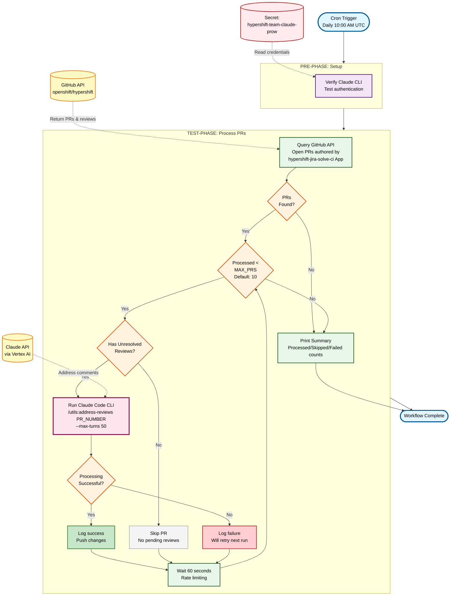

# HyperShift Review Agent Workflow

Automated periodic job that addresses review comments on PRs created by the HyperShift Jira Agent using Claude Code.

## Overview

This workflow implements a fully automated system for addressing PR review comments:

1. **Query**: Searches GitHub for open PRs from the hypershift-community fork that were created by the Jira Agent
2. **Filter**: Identifies PRs with unresolved review threads that need attention
3. **Process**: For each PR, runs the `/utils:address-reviews` command to analyze and address review comments
4. **Push**: Commits and pushes changes back to the PR branch

## Data Flow Diagram



## Components

### Workflow
- **File**: `hypershift-review-agent-workflow.yaml`
- **Description**: Defines the two-phase workflow (pre/test)

### Steps

#### 1. Setup (`hypershift-review-agent-setup`)
- Verifies Claude Code CLI availability
- Authenticates via Vertex AI

#### 2. Process (`hypershift-review-agent-process`)
- Clones ai-helpers and hypershift repositories
- Queries GitHub API for agent-created PRs
- Runs `comment_analyzer.py` to identify comments needing attention (prevents duplicate responses)
- Runs `/utils:address-reviews` for each PR with pending reviews
- Implements rate limiting (60s between PRs)

#### 3. Comment Analyzer (`comment_analyzer.py`)
- Python script that analyzes PR comments to prevent duplicate bot responses
- Fetches review threads and issue comments via GitHub API
- Compares timestamps to determine if bot already replied
- Outputs JSON list of threads/comments that need attention

## Configuration

### Secrets Required

The workflow requires secrets in the `test-credentials` namespace:

1. **`hypershift-team-claude-prow`**
   - Key: `claude-prow` - GCP service account JSON for Vertex AI
   - Key: `app-id` - GitHub App ID
   - Key: `installation-id` - Installation ID for hypershift-community fork
   - Key: `o-h-installation-id` - Installation ID for openshift/hypershift
   - Key: `private-key` - GitHub App private key
   - Mount path: `/var/run/claude-code-service-account`

### Periodic Job

Configured in `ci-operator/config/openshift/hypershift/openshift-hypershift-main.yaml`:

```yaml
- as: periodic-review-agent
  cron: 0 10 * * *  # Daily at 10:00 AM UTC (1 hour after jira-agent)
  steps:
    env:
      REVIEW_AGENT_MAX_PRS: "10"
    workflow: hypershift-review-agent
```

### On-Demand Single PR Job

An optional presubmit job allows processing a specific PR on-demand:

```yaml
- always_run: false
  as: review-agent-single-pr
  optional: true
  skip_if_only_changed: .*
  steps:
    workflow: hypershift-review-agent
```

**Usage**: Run `/test review-agent-single-pr` on any PR in openshift/hypershift. The job will process reviews for that specific PR using the `PULL_NUMBER` environment variable provided by Prow.

This is useful for:
- Testing the review agent on a specific PR
- Debugging issues with review processing
- Manually triggering review processing without waiting for the periodic job

### Environment Variables

- **`REVIEW_AGENT_MAX_PRS`** (default: `10`)
  - Maximum number of PRs to process per run
  - Includes both processed and skipped PRs in the count

- **`REVIEW_AGENT_TARGET_PR`** (optional)
  - Explicit PR number to process
  - If set, only this PR will be processed regardless of author
  - Takes precedence over `PULL_NUMBER`

- **`PULL_NUMBER`** (automatic in presubmit)
  - Provided by Prow for presubmit jobs
  - Used when `REVIEW_AGENT_TARGET_PR` is not set

## PR Identification

PRs are identified as agent-created using the GitHub App author filter:
- Open PRs authored by `app/hypershift-jira-solve-ci`

This reliably identifies PRs created by the Jira Agent GitHub App, which is more robust than regex matching on PR body text.

## How It Works

### Non-Interactive Execution

The workflow uses Claude Code CLI's non-interactive mode:

```bash
claude -p "$PR_NUMBER. $REVIEW_CONTEXT" \
  --system-prompt "$SKILL_CONTENT" \
  --allowedTools "Bash Read Write Edit Grep Glob WebFetch" \
  --max-turns 50 \
  --output-format stream-json
```

### Comment Analysis and Duplicate Prevention

The workflow uses a Python script (`comment_analyzer.py`) to analyze PR comments and prevent duplicate bot responses. This addresses the issue where the bot would respond multiple times to the same feedback.

#### How It Works

1. **Fetches all comments**: Uses GitHub's GraphQL API to retrieve review threads and issue comments
2. **Analyzes conversation timeline**: Sorts comments chronologically to understand conversation flow
3. **Identifies threads needing attention**: Only includes threads where:
   - No bot reply exists, OR
   - A human commented AFTER the last bot reply
4. **Filters already-addressed feedback**: Threads where the bot already replied and no human follow-up exists are skipped

#### What Gets Processed

A comment/thread needs attention when:

| Condition | Action |
|-----------|--------|
| No bot reply in thread | Process (first response needed) |
| Human replied after bot's last comment | Process (follow-up needed) |
| Bot already replied, no human follow-up | Skip (already addressed) |
| Thread is resolved | Skip (marked complete by reviewer) |
| Thread is outdated (code changed) | Skip (likely addressed by code change) |

#### What Counts as an Unresolved Review Thread

A review thread is considered **unresolved** when:

1. **Inline code comments**: A reviewer left a comment on a specific line of code in the "Files changed" tab, and no one has clicked "Resolve conversation"
2. **Review comments with suggestions**: Comments that include suggested code changes that haven't been resolved
3. **Threaded discussions**: Any reply chain started from a code review that remains open

A review thread is **NOT** created by:

- General PR comments (comments in the main "Conversation" tab that aren't attached to code)
- PR reviews that only contain an approval/request changes without inline comments
- Commit comments

**Visual indicator**: In GitHub's UI, unresolved threads show an "Unresolved" label and a "Resolve conversation" button. Resolved threads are collapsed and show "Resolved".

#### Response Rules

When addressing feedback, the bot follows these rules:
1. **One response per feedback**: Never respond to the same feedback via both inline reply AND general PR comment
2. **Code changes only when requested**: Only modifies code when explicitly asked (imperative language like "change", "fix", "update")
3. **Explanations for questions**: Replies with explanation only for clarifying questions, without code changes

### Rate Limiting

- 60 seconds between processing each PR
- Maximum 50 agentic turns per PR
- Maximum PRs per run: configurable via `REVIEW_AGENT_MAX_PRS`
- Runs once daily at 10:00 AM UTC (1 hour after jira-agent)

## Container Image

Uses the `claude-ai-helpers` image from OpenShift CI containing:
- Claude Code CLI
- GitHub CLI (gh)
- jq, git, curl
- Required dependencies

## Relationship to Jira Agent

This workflow is a companion to the `hypershift-jira-agent` workflow:

| Aspect | Jira Agent | Review Agent |
|--------|------------|--------------|
| Purpose | Create PRs from Jira issues | Address review comments on PRs |
| Schedule | Daily 9:00 AM UTC | Daily 10:00 AM UTC |
| Input | Jira issues with `issue-for-agent` label | PRs created by Jira Agent |
| Output | Draft PRs | Updated PR branches |
| Command | `/jira-solve` | `/utils:address-reviews` |

## Monitoring

### Success Indicators
- PRs processed successfully with changes pushed
- No authentication errors
- Review comments addressed

### Failure Indicators
- Failed to authenticate with Claude API
- Failed to push changes (GitHub auth issues)
- Individual PR processing failures

### Logs
Check Prow job logs for:
- GitHub query results
- Processing output for each PR
- Error messages

## Troubleshooting

### Issue: No PRs being processed
- Check that jira-agent has created PRs
- Verify PRs are open and authored by `app/hypershift-jira-solve-ci`

### Issue: PRs skipped (no pending reviews)
- This is normal - PRs without unresolved review threads are skipped
- Check GitHub for actual review status

### Issue: Authentication failures
- Verify secrets are mounted correctly
- Check API keys are valid and not expired
- Ensure GitHub App has required permissions

### Issue: Push fails
- Check GitHub App installation permissions for fork
- Verify branch exists and is not protected

## Future Enhancements

- Slack notifications for addressed reviews
- Priority-based processing (older reviews first)
- Automatic retry for transient failures
- Metrics push to Prometheus
