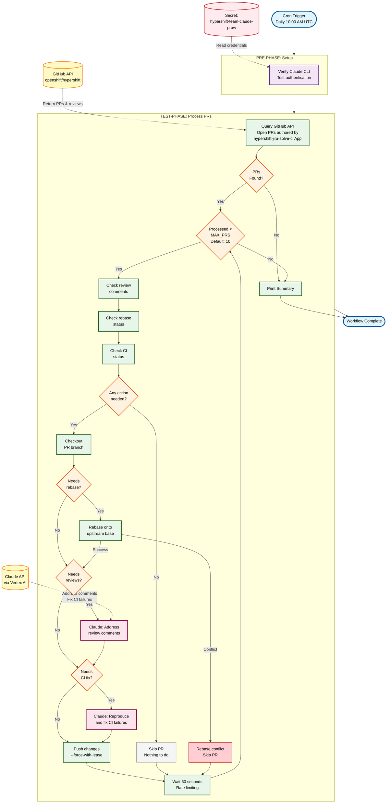

# HyperShift Review Agent Workflow

Automated periodic job that addresses review comments, rebases branches, and fixes CI failures on PRs created by the HyperShift Jira Agent using Claude Code.

## Overview

This workflow implements a fully automated system for PR maintenance:

1. **Query**: Searches GitHub for open PRs from the hypershift-community fork that were created by the Jira Agent
2. **Detect**: For each PR, checks three independent concerns (all API-only, no checkout needed):
   - **Reviews**: Identifies unresolved review threads needing attention
   - **Rebase**: Detects when the PR branch is behind its base branch
   - **CI Failures**: Detects failing verify/unit/lint CI checks
3. **Process**: Checks out the branch and handles each detected concern in order:
   - Rebase onto upstream base branch (skip PR on conflict)
   - Address review comments using `/utils:address-reviews`
   - Reproduce and fix CI failures locally using Claude
4. **Push**: Single force-push at the end if any phase made changes

## Data Flow Diagram


```mermaid
flowchart TD
    %% Trigger
    Start([Cron Trigger<br/>Daily 10:00 AM UTC]):::trigger --> PrePhase

    %% PRE-PHASE: Setup
    subgraph PrePhase[PRE-PHASE: Setup]
        direction TB
        Verify[Verify Claude CLI<br/>Test authentication]:::setup
    end

    %% Secrets for Setup
    Secret1[(Secret:<br/>hypershift-team-claude-prow)]:::secret -.->|Read credentials| Verify

    %% TEST-PHASE: Process
    PrePhase --> TestPhase

    subgraph TestPhase[TEST-PHASE: Process PRs]
        direction TB

        QueryGitHub[Query GitHub API<br/>Open PRs authored by<br/>hypershift-jira-solve-ci App]:::process

        CheckPRs{PRs<br/>Found?}:::decision
        CheckMax{Processed <<br/>MAX_PRS<br/>Default: 10}:::decision

        %% Detection phase (API-only)
        DetectReviews[Check review<br/>comments]:::process
        DetectRebase[Check rebase<br/>status]:::process
        DetectCI[Check CI<br/>status]:::process
        CheckAnyAction{Any action<br/>needed?}:::decision

        %% Processing phases
        Checkout[Checkout<br/>PR branch]:::process
        DoRebase{Needs<br/>rebase?}:::decision
        PerformRebase[Rebase onto<br/>upstream base]:::process
        RebaseConflict[Rebase conflict<br/>Skip PR]:::failure
        DoReviews{Needs<br/>reviews?}:::decision
        ProcessReviews[Claude: Address<br/>review comments]:::ai
        DoCIFix{Needs<br/>CI fix?}:::decision
        ProcessCIFix[Claude: Reproduce<br/>and fix CI failures]:::ai
        Push[Push changes<br/>--force-with-lease]:::process

        LogSkip[Skip PR<br/>Nothing to do]:::skip
        RateLimit[Wait 60 seconds<br/>Rate limiting]:::process
        Summary[Print Summary]:::process

        QueryGitHub --> CheckPRs
        CheckPRs -->|No| Summary
        CheckPRs -->|Yes| CheckMax
        CheckMax -->|No| Summary
        CheckMax -->|Yes| DetectReviews
        DetectReviews --> DetectRebase
        DetectRebase --> DetectCI
        DetectCI --> CheckAnyAction
        CheckAnyAction -->|No| LogSkip
        CheckAnyAction -->|Yes| Checkout
        Checkout --> DoRebase
        DoRebase -->|Yes| PerformRebase
        DoRebase -->|No| DoReviews
        PerformRebase -->|Conflict| RebaseConflict
        PerformRebase -->|Success| DoReviews
        DoReviews -->|Yes| ProcessReviews
        DoReviews -->|No| DoCIFix
        ProcessReviews --> DoCIFix
        DoCIFix -->|Yes| ProcessCIFix
        DoCIFix -->|No| Push
        ProcessCIFix --> Push
        Push --> RateLimit
        LogSkip --> RateLimit
        RebaseConflict --> RateLimit
        RateLimit --> CheckMax
    end

    %% External Systems
    GitHubAPI[(GitHub API<br/>openshift/hypershift)]:::external -.->|Return PRs & reviews| QueryGitHub
    ClaudeAPI[(Claude API<br/>via Vertex AI)]:::external -.->|Address comments<br/>Fix CI failures| ProcessReviews

    TestPhase --> End([Workflow Complete]):::trigger
    Summary --> End

    %% Style Definitions
    classDef trigger fill:#e1f5ff,stroke:#01579b,stroke-width:3px,color:#000
    classDef setup fill:#f3e5f5,stroke:#4a148c,stroke-width:2px,color:#000
    classDef process fill:#e8f5e9,stroke:#1b5e20,stroke-width:2px,color:#000
    classDef decision fill:#fff3e0,stroke:#e65100,stroke-width:2px,color:#000
    classDef ai fill:#fce4ec,stroke:#880e4f,stroke-width:3px,color:#000
    classDef success fill:#c8e6c9,stroke:#2e7d32,stroke-width:2px,color:#000
    classDef failure fill:#ffcdd2,stroke:#c62828,stroke-width:2px,color:#000
    classDef skip fill:#f5f5f5,stroke:#757575,stroke-width:1px,color:#000
    classDef external fill:#fff9c4,stroke:#f57f17,stroke-width:2px,color:#000
    classDef secret fill:#ffebee,stroke:#b71c1c,stroke-width:2px,color:#000
```

## Processing Order

For each PR, phases execute in this order:

1. **Rebase** (if branch is behind base)
   - Fetches upstream and rebases
   - On conflict: logs failure, skips remaining phases for this PR
2. **Reviews** (if unresolved review threads exist)
   - Uses existing `/utils:address-reviews` Claude invocation
   - Posts replies and makes code changes as requested
3. **CI Fixes** (if verify/unit/lint checks are failing and `REVIEW_AGENT_ENABLE_CI_FIXES=true`)
   - Claude reproduces failures locally using `make verify`, `go test`, etc.
   - Fixes code iteratively until checks pass
4. **Push** (single push at end)
   - `git push --force-with-lease` if any phase made changes

## Components

### Workflow
- **File**: `hypershift-review-agent-workflow.yaml`
- **Description**: Defines the three-phase workflow (pre/test/post)

### Steps

#### 1. Setup (`hypershift-review-agent-setup`)
- Verifies Claude Code CLI availability
- Authenticates via Vertex AI

#### 2. Process (`hypershift-review-agent-process`)
- Clones ai-helpers and hypershift repositories
- Queries GitHub API for agent-created PRs
- For each PR, detects needs (reviews, rebase, CI fixes)
- Runs `comment_analyzer.py` to identify comments needing attention
- Runs `/utils:address-reviews` for PRs with pending reviews
- Runs Claude CI fix invocation for PRs with failing checks
- Performs rebase for PRs with branches behind base
- Single push at end of all phases

#### 3. Report (`hypershift-review-agent-report`)
- Reads per-PR actions JSON and Claude summaries
- Generates HTML report with per-phase token usage and cost
- Shows action badges (Rebased, Reviews, CI Fix) per PR

#### 4. Comment Analyzer (`comment_analyzer.py`)
- Python script that analyzes PR comments to prevent duplicate bot responses
- Fetches review threads and issue comments via GitHub API
- Compares timestamps to determine if bot already replied
- Outputs JSON list of threads/comments that need attention

## CI Failure Handling

The agent detects and fixes CI check failures matching `verify`, `unit`, or `lint` patterns.

### How It Works

1. **Detection**: Uses `gh pr checks` to find failed checks matching the patterns
2. **Local Reproduction**: Claude runs the same commands CI uses (`make verify`, `go test`, linters)
3. **Fix**: Claude diagnoses the root cause and makes targeted code changes
4. **Verification**: Claude re-runs the failing command to confirm the fix works

### Available Build Tools

The `claude-ai-helpers` container image is based on `ocp/builder:rhel-9-golang-1.25-openshift-4.22`, providing:
- Go 1.25 toolchain
- `make` and standard build tools
- All dependencies needed to build and test HyperShift

### Check Types Handled

| Check Pattern | Reproduction Command | Common Fixes |
|---------------|---------------------|--------------|
| `verify` | `make verify` | Formatting, imports, generated files |
| `unit` | `make test` / `go test ./...` | Test logic, API changes |
| `lint` / `gitlint` | Linter / `gitlint` | Code style, commit messages |

## Rebase Handling

### When Triggered
- PR's `mergeStateStatus` is `BEHIND` (branch behind base, no conflicts)
- PR's `mergeStateStatus` is `DIRTY` (branch behind base, may have conflicts)

### Conflict Handling
- If `git rebase` fails, the rebase is aborted (`git rebase --abort`)
- The PR is logged as `FAILED rebase_conflict`
- Remaining phases (reviews, CI fix) are skipped for that PR

## Configuration

### Secrets Required

The workflow requires secrets in the `test-credentials` namespace:

1. **`hypershift-team-claude-prow`**
   - Key: `claude-prow` - GCP service account JSON for Vertex AI
   - Key: `app-id` - GitHub App ID
   - Key: `installation-id` - Installation ID for hypershift-community fork
   - Key: `o-h-installation-id` - Installation ID for openshift/hypershift
   - Key: `private-key` - GitHub App private key
   - Mount path: `/var/run/claude-code-service-account`

### Periodic Job

Configured in `ci-operator/config/openshift/hypershift/openshift-hypershift-main.yaml`:

```yaml
- as: periodic-review-agent
  cron: 0 10 * * *  # Daily at 10:00 AM UTC (1 hour after jira-agent)
  steps:
    env:
      REVIEW_AGENT_MAX_PRS: "10"
    workflow: hypershift-review-agent
```

### On-Demand Single PR Job

An optional presubmit job allows processing a specific PR on-demand:

```yaml
- always_run: false
  as: address-review-comments
  optional: true
  skip_if_only_changed: .*
  steps:
    workflow: hypershift-review-agent
```

**Usage**: Run `/test address-review-comments` on any PR in openshift/hypershift. The job will process reviews for that specific PR using the `PULL_NUMBER` environment variable provided by Prow.

This is useful for:
- Testing the review agent on a specific PR
- Debugging issues with review processing
- Manually triggering review processing without waiting for the periodic job

### Environment Variables

- **`REVIEW_AGENT_MAX_PRS`** (default: `10`)
  - Maximum number of PRs to process per run
  - Includes both processed and skipped PRs in the count

- **`REVIEW_AGENT_ENABLE_CI_FIXES`** (default: `true`)
  - Controls whether CI failure detection and fixing is active
  - When enabled, the agent detects failing verify/unit/lint checks and invokes Claude to reproduce and fix failures locally

- **`REVIEW_AGENT_TARGET_PR`** (optional)
  - Explicit PR number to process
  - If set, only this PR will be processed regardless of author
  - Takes precedence over `PULL_NUMBER`

- **`PULL_NUMBER`** (automatic in presubmit)
  - Provided by Prow for presubmit jobs
  - Used when `REVIEW_AGENT_TARGET_PR` is not set

## PR Identification

PRs are identified as agent-created using the GitHub App author filter:
- Open PRs authored by `app/hypershift-jira-solve-ci`

This reliably identifies PRs created by the Jira Agent GitHub App, which is more robust than regex matching on PR body text.

## How It Works

### Non-Interactive Execution

The workflow uses Claude Code CLI's non-interactive mode:

```bash
claude -p "$PR_NUMBER. $REVIEW_CONTEXT" \
  --system-prompt "$SKILL_CONTENT" \
  --allowedTools "Bash Read Write Edit Grep Glob WebFetch" \
  --max-turns 150 \
  --output-format stream-json
```

### Comment Analysis and Duplicate Prevention

The workflow uses a Python script (`comment_analyzer.py`) to analyze PR comments and prevent duplicate bot responses. This addresses the issue where the bot would respond multiple times to the same feedback.

#### How It Works

1. **Fetches all comments**: Uses GitHub's GraphQL API to retrieve review threads and issue comments
2. **Analyzes conversation timeline**: Sorts comments chronologically to understand conversation flow
3. **Identifies threads needing attention**: Only includes threads where:
   - No bot reply exists, OR
   - A human commented AFTER the last bot reply
4. **Filters already-addressed feedback**: Threads where the bot already replied and no human follow-up exists are skipped

#### What Gets Processed

A comment/thread needs attention when:

| Condition | Action |
|-----------|--------|
| No bot reply in thread | Process (first response needed) |
| Human replied after bot's last comment | Process (follow-up needed) |
| Bot already replied, no human follow-up | Skip (already addressed) |
| Thread is resolved | Skip (marked complete by reviewer) |
| Thread is outdated (code changed) | Skip (likely addressed by code change) |

#### Response Rules

When addressing feedback, the bot follows these rules:
1. **One response per feedback**: Never respond to the same feedback via both inline reply AND general PR comment
2. **Code changes only when requested**: Only modifies code when explicitly asked (imperative language like "change", "fix", "update")
3. **Explanations for questions**: Replies with explanation only for clarifying questions, without code changes

### Rate Limiting

- 60 seconds between processing each PR
- Maximum 150 agentic turns per PR per phase
- Maximum PRs per run: configurable via `REVIEW_AGENT_MAX_PRS`
- Runs once daily at 10:00 AM UTC (1 hour after jira-agent)

## Container Image

Uses the `claude-ai-helpers` image from OpenShift CI containing:
- Claude Code CLI
- GitHub CLI (gh)
- Go 1.25 toolchain, make, and standard build tools
- jq, git, curl
- Required dependencies

## Relationship to Jira Agent

This workflow is a companion to the `hypershift-jira-agent` workflow:

| Aspect | Jira Agent | Review Agent |
|--------|------------|--------------|
| Purpose | Create PRs from Jira issues | Address reviews, rebase, fix CI |
| Schedule | Daily 9:00 AM UTC | Daily 10:00 AM UTC |
| Input | Jira issues with `issue-for-agent` label | PRs created by Jira Agent |
| Output | Draft PRs | Updated PR branches |
| Command | `/jira-solve` | `/utils:address-reviews` + CI fix |

## Monitoring

### Success Indicators
- PRs processed successfully with changes pushed
- No authentication errors
- Review comments addressed
- CI failures fixed
- Branches rebased

### Failure Indicators
- Failed to authenticate with Claude API
- Failed to push changes (GitHub auth issues)
- Rebase conflicts
- Individual PR processing failures

### Logs
Check Prow job logs for:
- GitHub query results
- Detection phase results (reviews, rebase, CI status)
- Processing output for each PR and phase
- Error messages

## Troubleshooting

### Issue: No PRs being processed
- Check that jira-agent has created PRs
- Verify PRs are open and authored by `app/hypershift-jira-solve-ci`

### Issue: PRs skipped (no action needed)
- This is normal - PRs without reviews, rebase needs, or CI failures are skipped
- Check GitHub for actual review/CI/merge status

### Issue: Rebase conflicts
- The agent will abort the rebase and skip the PR
- Manual intervention is needed to resolve conflicts

### Issue: CI fixes not working
- Verify `REVIEW_AGENT_ENABLE_CI_FIXES` is set to `true`
- Check that the failing checks match `verify|unit|lint` patterns
- Review Claude's CI fix output in the HTML report for diagnosis details

### Issue: Authentication failures
- Verify secrets are mounted correctly
- Check API keys are valid and not expired
- Ensure GitHub App has required permissions

### Issue: Push fails
- Check GitHub App installation permissions for fork
- Verify branch exists and is not protected
