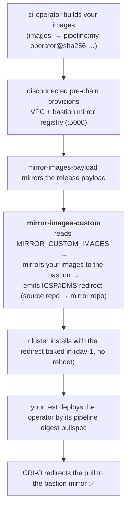

# mirror-images-custom

Mirror **arbitrary container images** — the images your CI job builds (`pipeline:*`), or any
external pullspec — into the **bastion mirror registry** of a **disconnected** cloud cluster
(AWS/Azure/GCP), and emit the matching image-mirror redirect so the cluster pulls them from the
mirror. Your test deploys the images by their normal pullspecs; the redirect does the rest —
**no test-code change**. This is the cloud equivalent of the bare-metal dev-scripts
`MIRROR_CUSTOM_IMAGES` capability.

Any team can consume it; `kubernetes-nmstate` is the representative example.

## How it works



The redirect works with no test change because ci-operator resolves `pipeline:*` dependencies to
**digest** pullspecs, and the emitted `ImageContentSourcePolicy` / `ImageDigestMirrorSet` redirect
those digests to the mirror.

## Consume it in 3 steps

1. **Build your images** (`images:` in your ci-operator config → `pipeline:my-operator`).
2. **Use a disconnected pre-chain** for your platform and set one env var:

   ```yaml
   tests:
   - as: e2e-aws-disconnected
     optional: true
     always_run: false
     steps:
       cluster_profile: aws
       env:
         MIRROR_CUSTOM_IMAGES: "my-operator,my-operand"   # pipeline tags (or full pullspecs)
       workflow: my-operator-e2e-aws-disconnected
   ```

   ```yaml
   workflow:
     as: my-operator-e2e-aws-disconnected
     steps:
       pre:  [ {chain: ipi-aws-pre-disconnected} ]   # provisions + runs mirror-images-custom
       test: [ {ref: my-operator-e2e} ]              # your e2e, deploys images by pipeline pullspec
       post: [ {chain: ipi-aws-post-disconnected} ]
   ```

3. **Deploy by digest + reach the API** in your e2e ref:

   ```yaml
   ref:
     as: my-operator-e2e
     from: src
     commands: my-operator-e2e-commands.sh
     dependencies:
     - {env: OPERATOR_IMAGE, name: pipeline:my-operator}   # ci-operator injects the digest pullspec
     - {env: OPERAND_IMAGE,  name: pipeline:my-operand}
   ```

   ```bash
   # my-operator-e2e-commands.sh
   export KUBECONFIG=${SHARED_DIR}/kubeconfig
   # disconnected/Internal clusters are only reachable via the bastion proxy (no-op otherwise):
   if test -f "${SHARED_DIR}/proxy-conf.sh"; then source "${SHARED_DIR}/proxy-conf.sh"; fi
   # deploy using $OPERATOR_IMAGE / $OPERAND_IMAGE — the cluster redirects those pulls to the mirror
   ```

### Checklist

- [ ] Images built in `images:` → available as `pipeline:<name>`.
- [ ] `MIRROR_CUSTOM_IMAGES` lists **every** image the workload deploys (operands, sidecars, plugins).
- [ ] e2e deploys those images by their `pipeline:*` pullspec (declared as `dependencies:`).
- [ ] e2e sources `${SHARED_DIR}/proxy-conf.sh`.
- [ ] Use the disconnected pre-chain for your platform.
- [ ] (Azure IPv6) add `FEATURE_SET: TechPreviewNoUpgrade`.
- [ ] (External image by **tag**) set `ENABLE_IDMS=yes` chain-wide (see below).

## Reference

### Env

| Env | Default | Meaning |
|---|---|---|
| `MIRROR_CUSTOM_IMAGES` | `""` | Comma-separated pipeline tags (`my-operator`) and/or full external pullspecs (`quay.io/org/img:tag`, `…@sha256:…`). Empty ⇒ no-op. |
| `MIRROR_IN_BASTION` | `"yes"` | Mirror over SSH on the bastion; `"no"` mirrors from the build-farm pod. |
| `CUSTOM_MIRROR_APPLY_MODE` | `"manifest"` | Publish the redirect as a day-1 `manifest_*.yaml`. |

### Redirect family

A cluster cannot mix `ImageContentSourcePolicy` (ICSP) with `ImageDigestMirrorSet`/
`ImageTagMirrorSet` (IDMS/ITMS); this step auto-detects and matches whatever the release-payload
mirror established. **Digest** sources work with either family. **Tag**-referenced external images
require IDMS/ITMS — set `ENABLE_IDMS=yes` at the chain level (an `ImageTagMirrorSet` is then
emitted). Under ICSP, a tag source fails fast with a clear error.

### Platform support

| Platform | Pre-chain | IPv4 | IPv6 |
|---|---|---|---|
| AWS | `ipi-aws-pre-disconnected` | ✅ | ✅ `IP_FAMILY=DualStackIPv6Primary` |
| Azure | `ipi-azure-pre-disconnected` | ✅ | ✅ `IP_FAMILY=DualStackIPv6Primary` + `FEATURE_SET=TechPreviewNoUpgrade` |
| GCP | `ipi-gcp-pre-disconnected` | ✅ | ❌ platform has no dual-stack |

### Consumed `SHARED_DIR` contracts

Written by the cloud bastion provisioning: `mirror_registry_url`, `bastion_public_address`,
`bastion_private_address`, `bastion_ssh_user`; and `install-config-mirror.yaml.patch` (family
detection). Requires the `openshift-custom-mirror-registry` credential, and
`CLUSTER_PROFILE_DIR/ssh-privatekey` when `MIRROR_IN_BASTION=yes`.

## Gotchas

- ci-operator only builds `pipeline:*` images in the test's dependency graph, and only **digest**
  refs are redirected — declaring your images as `dependencies:` on the e2e ref gives you both.
- List **every** image the workload pulls (a missed sidecar/plugin will ImagePullBackOff).
- Azure dual-stack is TechPreview (`FEATURE_SET=TechPreviewNoUpgrade`).
