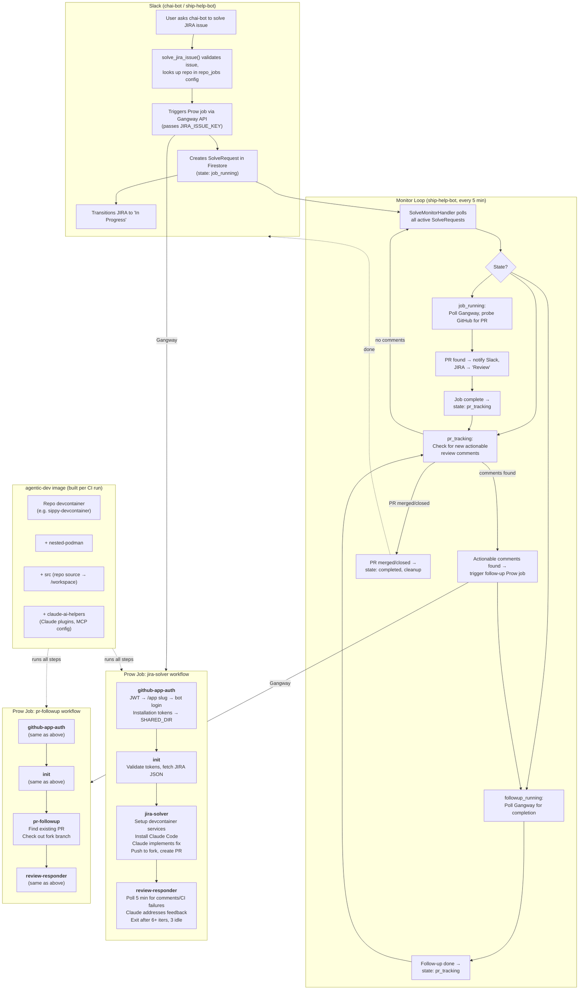
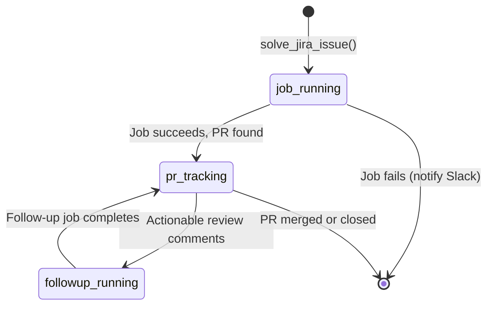

# Agentic Solve Architecture

End-to-end flow from Slack request to merged PR.

## High-Level Flow



## Component Reference

### ship-help-bot (Slack bot)

| Component | Path | Role |
|-----------|------|------|
| Tool functions | [`ship_help_bot/tools/agentic_solver/tools.py`][tools] | Entry points: `solve_jira_issue`, `notify_review_ready`, `list_active_solves`, `cancel_solve` |
| Monitor handler | [`ship_help_bot/tools/agentic_solver/handler.py`][handler] | Scheduled every 5 min. State machine: `job_running` → `pr_tracking` ⇄ `followup_running` → `completed` |
| State tracker | [`ship_help_bot/tools/agentic_solver/tracker.py`][tracker] | `SolveRequest` CRUD in Firestore (collection: `agentic_solves`, 30-day TTL) |
| GitHub client | [`ship_help_bot/tools/agentic_solver/github_client.py`][ghclient] | PR lookup, review comment fetching, actionability classification |
| JIRA helpers | [`ship_help_bot/tools/agentic_solver/jira_helpers.py`][jira] | Safe wrappers for JIRA transitions and assignment |
| Config | [`config/workspaces.yaml`][workspaces] | `repo_jobs` mapping (repo → solve job + followup job + fork), `ignored_bots` list |

[tools]: https://github.com/openshift/ship-help-bot/blob/main/ship_help_bot/tools/agentic_solver/tools.py
[handler]: https://github.com/openshift/ship-help-bot/blob/main/ship_help_bot/tools/agentic_solver/handler.py
[tracker]: https://github.com/openshift/ship-help-bot/blob/main/ship_help_bot/tools/agentic_solver/tracker.py
[ghclient]: https://github.com/openshift/ship-help-bot/blob/main/ship_help_bot/tools/agentic_solver/github_client.py
[jira]: https://github.com/openshift/ship-help-bot/blob/main/ship_help_bot/tools/agentic_solver/jira_helpers.py
[workspaces]: https://github.com/openshift/ship-help-bot/blob/main/config/workspaces.yaml

### CI Step Registry (release repo)

All steps live under [`ci-operator/step-registry/openshift/agentic/trt/`][registry].

| Step | Ref YAML | Script | Inputs | Outputs |
|------|----------|--------|--------|---------|
| **github-app-auth** | [`github-app-auth-ref.yaml`][auth-ref] | [`github-app-auth-commands.sh`][auth-sh] | `trt-agent-gh-app` credential (app-id, private-key, installation IDs) | `gh-fork-token`, `gh-upstream-token`, `gh-app-bot-login` |
| **init** | [`init-ref.yaml`][init-ref] | [`init-commands.sh`][init-sh] | `JIRA_ISSUE_KEY`, tokens from SHARED_DIR | `jira-issue-key`, `jira-issue.json` |
| **jira-solver** | [`jira-solver-ref.yaml`][solver-ref] | [`jira-solver-commands.sh`][solver-sh] | JIRA JSON, tokens, `SETUP_SCRIPT`, `ALLOWED_TOOLS` | `pr-number`, `claude-output.log`, PR on fork |
| **pr-followup** | [`pr-followup-ref.yaml`][followup-ref] | [`pr-followup-commands.sh`][followup-sh] | JIRA key, tokens | `pr-number` |
| **review-responder** | [`review-responder-ref.yaml`][responder-ref] | [`review-responder-commands.sh`][responder-sh] | `pr-number`, tokens, `gh-app-bot-login` | Comment replies, pushed fixes |

[registry]: https://github.com/openshift/release/tree/main/ci-operator/step-registry/openshift/agentic/trt
[auth-ref]: https://github.com/openshift/release/blob/main/ci-operator/step-registry/openshift/agentic/trt/github-app-auth/openshift-agentic-trt-github-app-auth-ref.yaml
[auth-sh]: https://github.com/openshift/release/blob/main/ci-operator/step-registry/openshift/agentic/trt/github-app-auth/openshift-agentic-trt-github-app-auth-commands.sh
[init-ref]: https://github.com/openshift/release/blob/main/ci-operator/step-registry/openshift/agentic/trt/init/openshift-agentic-trt-init-ref.yaml
[init-sh]: https://github.com/openshift/release/blob/main/ci-operator/step-registry/openshift/agentic/trt/init/openshift-agentic-trt-init-commands.sh
[solver-ref]: https://github.com/openshift/release/blob/main/ci-operator/step-registry/openshift/agentic/trt/jira-solver/openshift-agentic-trt-jira-solver-ref.yaml
[solver-sh]: https://github.com/openshift/release/blob/main/ci-operator/step-registry/openshift/agentic/trt/jira-solver/openshift-agentic-trt-jira-solver-commands.sh
[followup-ref]: https://github.com/openshift/release/blob/main/ci-operator/step-registry/openshift/agentic/trt/pr-followup/openshift-agentic-trt-pr-followup-ref.yaml
[followup-sh]: https://github.com/openshift/release/blob/main/ci-operator/step-registry/openshift/agentic/trt/pr-followup/openshift-agentic-trt-pr-followup-commands.sh
[responder-ref]: https://github.com/openshift/release/blob/main/ci-operator/step-registry/openshift/agentic/trt/review-responder/openshift-agentic-trt-review-responder-ref.yaml
[responder-sh]: https://github.com/openshift/release/blob/main/ci-operator/step-registry/openshift/agentic/trt/review-responder/openshift-agentic-trt-review-responder-commands.sh

### CI Operator Configs (Prow job definitions)

| Repo | Config | Solve Job | Follow-up Job |
|------|--------|-----------|---------------|
| openshift/sippy | [`openshift-sippy-main__agentic.yaml`][sippy-cfg] | `periodic-ci-openshift-sippy-main-agentic-periodic-sippy-jira-agent` | `periodic-ci-openshift-sippy-main-agentic-periodic-sippy-pr-followup-agent` |
| openshift/origin | [`openshift-origin-main__agentic.yaml`][origin-cfg] | `periodic-ci-openshift-origin-main-agentic-periodic-origin-jira-agent` | `periodic-ci-openshift-origin-main-agentic-periodic-origin-pr-followup-agent` |

Both are `cron: '@yearly'` (Gangway-triggered only, never scheduled).

[sippy-cfg]: https://github.com/openshift/release/blob/main/ci-operator/config/openshift/sippy/openshift-sippy-main__agentic.yaml
[origin-cfg]: https://github.com/openshift/release/blob/main/ci-operator/config/openshift/origin/openshift-origin-main__agentic.yaml

### Devcontainer (example: sippy)

The `agentic-dev` image is built per CI run via `dockerfile_literal` in the CI operator config. It layers four images:

```text
repo devcontainer (Fedora 43, Go, npm, Python, Chromium, gh, gcloud)
  + nested-podman (/entrypoint.sh, podman-in-pod)
  + src (repo source → /workspace)
  + claude-ai-helpers (Claude plugins, MCP config → /opt/ai-helpers)
```

The repo provides the runtime environment:

| File | Role |
|------|------|
| [`.devcontainer/Dockerfile`][dc-dockerfile] | Image definition: Fedora + Go + npm + postgres client + chromium + tooling |
| [`.devcontainer/devcontainer.json`][dc-json] | Container config: network, env vars (DSN, Redis, BigQuery), port forwards |
| [`.devcontainer/init-services.sh`][dc-init] | Starts PostgreSQL and Redis as podman containers on `sippy-net` |
| [`.devcontainer/post-create.sh`][dc-post] | Installs Go tools, `go mod download`, `make npm`, builds sippy, seeds DB |
| [`hack/agentic_setup.sh`][setup] | CI wrapper: sets env vars, calls `init-services.sh` + `post-create.sh` |
| [`.agentic/solve-config.md`][solve-cfg] | Repo-specific Claude instructions: run `make test`, `make lint`, use MCP tools |
| [`.agentic/followup-config.md`][followup-cfg] | Repo-specific follow-up instructions (appended to review-responder prompt) |
| [`CLAUDE.md`][claude-md] | Claude project context: DB migrations, coding conventions, test patterns |

[dc-dockerfile]: https://github.com/openshift/sippy/blob/main/.devcontainer/Dockerfile
[dc-json]: https://github.com/openshift/sippy/blob/main/.devcontainer/devcontainer.json
[dc-init]: https://github.com/openshift/sippy/blob/main/.devcontainer/init-services.sh
[dc-post]: https://github.com/openshift/sippy/blob/main/.devcontainer/post-create.sh
[setup]: https://github.com/openshift/sippy/blob/main/hack/agentic_setup.sh
[solve-cfg]: https://github.com/openshift/sippy/blob/main/.agentic/solve-config.md
[followup-cfg]: https://github.com/openshift/sippy/blob/main/.agentic/followup-config.md
[claude-md]: https://github.com/openshift/sippy/blob/main/CLAUDE.md

## State Machine



States are tracked in Firestore (`agentic_solves` collection), managed by `SolveMonitorHandler` every 5 minutes.

## Onboarding a New Repo

1. **Target repo**: Create `.devcontainer/` (Dockerfile, init-services.sh, etc.), `hack/agentic_setup.sh`, `.agentic/solve-config.md`, and `CLAUDE.md`
2. **Release repo**: Add CI operator config (`openshift-<repo>-main__agentic.yaml`) defining the `agentic-dev` image build and both periodic jobs
3. **ship-help-bot**: Add entry to `repo_jobs` in `config/workspaces.yaml` mapping the repo to its solve/followup job names and fork
